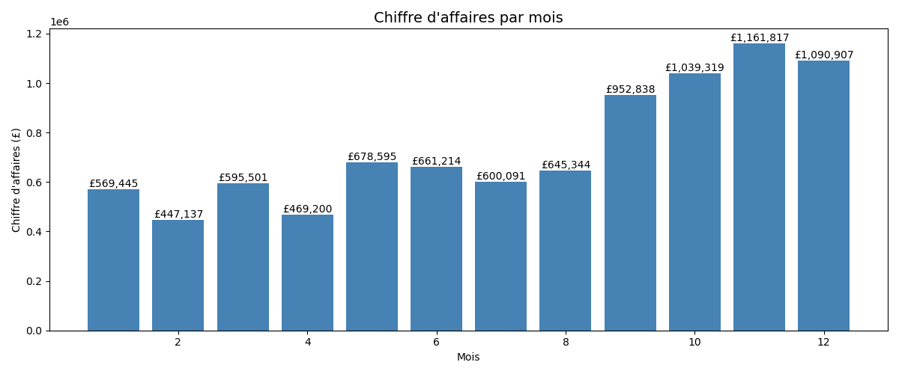
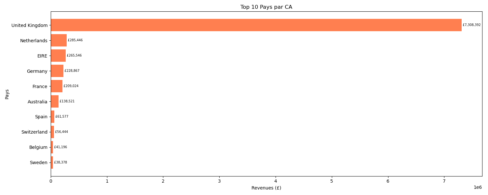
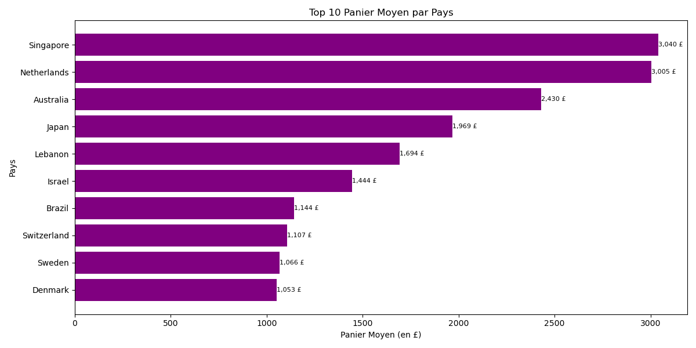
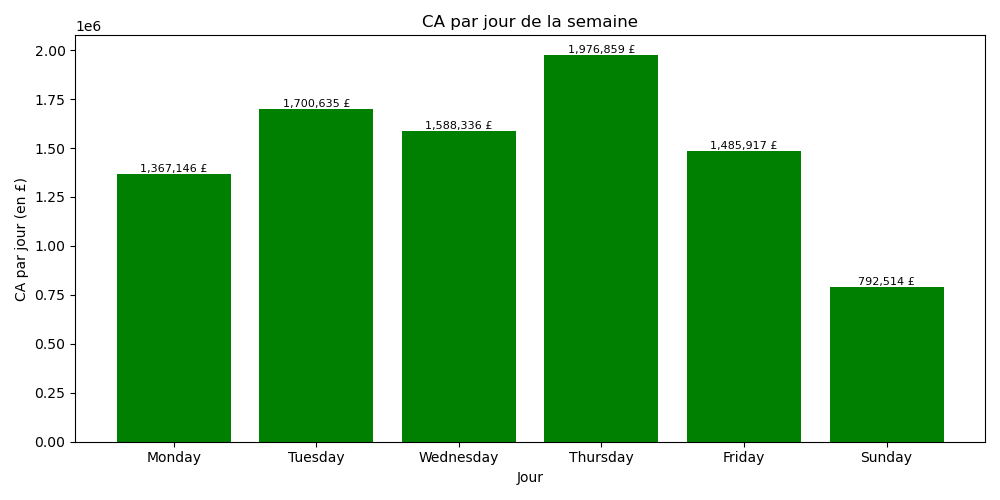
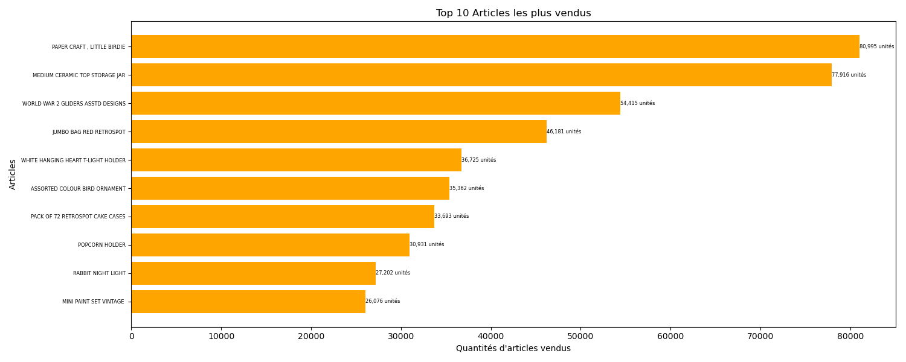

# ecommerce-eda
Analyse Exploratoire - Données E-Commerce

   CONTEXTE 
   
Analyse d'un dataset de ventes e-commerce réel contenant plus de 
500 000 transactions réalisées entre 2010 et 2011 par un e-commerce 
britannique vendant principalement en B2B.

   OBJECTIFS 
   
- Calculer les indicateurs business clés (panier moyen, CA total...)
- Analyser les tendances de ventes mensuelles
- Identifier les pays et produits les plus rentables
- Comprendre les comportements d'achat selon les jours

   TECHNOLOGIES UTILISÉES
  
- Python
- Pandas: Manipulation et analyse des données
- Matplotlib: Visualisation des données
- Jupiter Notebook: Environnement de développement

   INSIGHTS CLÉS
  
- CA Total: 8,911,408 £
- Nombre de clients uniques: 4,339
- Meilleur mois: Novembre
- Panier moyen: 480.76 £
- Article le plus vendu: PAPER CRAFT , LITTLE BIRDIE

   GRAPHIQUES
  
- CA par mois

- Top 10 pays par CA

- Panier moyen par pays

- CA par jour de la semaine

- Top 10 articles les plus vendus

   STRUCTURE DU PROJET
  
- "analyse_ecommerce_finale": Notebook avec l'analyse complète
- "data_sample.csv": Échantillon du dataset source
- "images/": Visualisations importées

   SOURCE DES DONNÉES
  
Dataset disponible sur Kaggle:
[E-Commerce Data](https://www.kaggle.com/datasets/carrie1/ecommerce-data)
